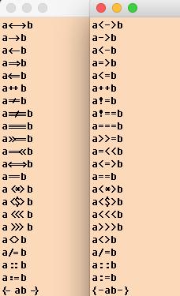
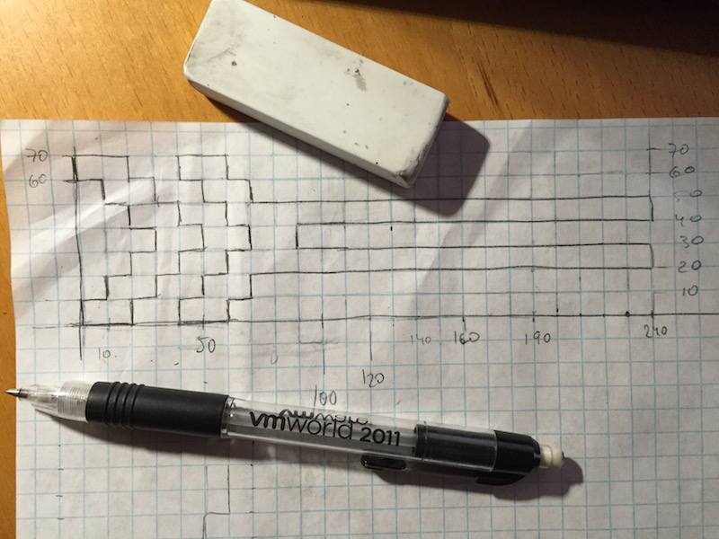

# Fixedsys Excelsior font with programming ligatures

## Distribution terms

The font was originally authored by Darien Valentine [@bathos](https://github.com/bathos) and provided via a now-defunct site at [fixedsysexcelsior.com](http://www.fixedsysexcelsior.com). This derivative's source code repository and issue tracker can be found at [github.com/kika/fixedsys](https://github.com/kika/fixedsys/).

The creator(s) of this content have released it to the public domain. For jurisdictions where this is not permitted, it is released under the terms of the Creative Commons Zero Dedication.

## It looks like this


## Where to get the result without compiling
The compiled TTF binary font is on the Releases page.
There are two versions provided:
1. Default has =< and >= ligated into "less or equal" and "greater or equal"
1. Alt version enables <= (replacing reverse fat arrow) and >= instead (closes #3)

### What is the ALT version in the releases about?

The fonts declare a set of ligatures that replace certain groups of adjacent characters by a combined glyph. The ALT variant has some of the ligature declarations swapped to facilitate code programming, where `<=` is almost always meant to be a less-or-equal operator, and also works for the general case too, based on the presumption that left fat arrows are seldomly used even in scientific texts.

| Input  | Normal variant   | ALT variant      |
|------- | ---------------- | ---------------- |
| `<=`   | left fat arrow   | less-or-equal    |
| `<==`  | left fat arrow   | left fat arrow   |
| `=>`   | right fat arrow  | right fat arrow  |
| `=<`   | less-or-equal    | (no ligature)    |
| `>=`   | greater-or-equal | greater-or-equal |
| `>==`  | (no ligature)    | (no ligature)    |

## Rationale
I (Kirill Pertsev) was always jealous for folks using [Fira Code](https://github.com/tonsky/FiraCode),
[Hasklig](https://github.com/i-tu/Hasklig) or [Monoid](https://github.com/larsenwork/monoid)
fonts, but my problem is that I have a hard time reading (not even mentioning writing)
a computer program in anything but an 8x16 font. I probably spent too much time with older
computers. So after fighting and losing an uphill battle with Glyph2, Fontlab and Fontforge
I discovered [TTX](https://github.com/behdad/fonttools) and was able to finally stop being jealous.

This current release has almost everything I use regularly. Feel free to request in the issues. PRs are of course
more than welcome. I hope I'm not the only crazy guy on the internet using 8x16
font for consoles and text editing.

## History
This font is a simulated 8x16 bitmap font from old Windows and DOS. It was
truly monospaced and really bitmapped and initially contained only
windows-1250, windows-1251, a subset of windows-1252, windows-1253
and windows-1254.
Darien simulated the bitmap with TrueType outlines by building the font from
10x10 squares ("pixels") and then joining the squares together. As such, this font
only works as intended in only one size and usually with antialiasing switched
off. The size is 16px, or 12pt@96dpi.

He also added a lot of foreign characters and made the font Unicode.

## Tech trivia
The font is distributed in binary TTF format and I decompiled it with
[TTX](https://github.com/behdad/fonttools), added a few symbols inspired by
[Fira Code](https://github.com/tonsky/FiraCode) and created necessary ligatures.

To design the symbols I used quad lined paper, pencil and rubber eraser. Like
in good old days, you know.


The supported programming ligatures are listed in the `ligatures.txt` file.

To create a TTF file from TTX XML, just run `ttx -f FSEX.ttx`
(`-f` means overwrite) or use the OS X Makefile to also copy it to the user Fonts
folder and update the font cache.

## Supported software (incomplete list, send updates please)

I only tested in MacVim so far (this is the only editor I use). Comments and bug
reports welcome. MacVim should be quite recent for ligatures to work.
**Note**: Versions of MacVim above 8.1-146 seem to have a regression where ligatures are not displayed correctly. Use `brew pin` to maintain your MacVim version below this until this is fixed.
[Tracking issue and workaround](https://github.com/macvim-dev/macvim/issues/841)

Add the following to your `.vimrc`:

```
set guifont=Fixedsys\ Excelsior:h16
set noanti
set macligatures
```
Courtesy of [@ForNeVeR](https://github.com/ForNeVeR):

- Windows + IDEA (Oracle JDK): renders ligatures, but have problems rendering latin `A` letter (it occupies no space in text and gets composed with a next character). There's a warning in IDEA interface telling about incompatibilities of Oracle JDK and fonts with ligatures.
- Windows + IDEA (JetBrains JDK): no problems noticed.
- Windows + VS Code:
  ```json
    "editor.fontFamily": "Fixedsys Excelsior",
    "editor.fontSize": 16,
    "editor.fontLigatures": true
    ```
  or, for newer versions (courtesy of [@Kaffiend](https://github.com/Kaffiend))
  
  ```json
  "editor.fontFamily": "'Fixedsys Excelsior 3.01'",
  "editor.fontSize": 15,
  "editor.fontLigatures": true
  ```
  **(The following is only for VSCode on MacOS)** For many people this may look ugly because Fixedsys is not designed to be used with antialiasing. Then you may add the following option
  
  ```json
   "workbench.fontAliasing": "none"
  ```
  
  Which will make code editor look nice, but everything else in the VSCode UI - ugly. The solution to that is to modify the CSS for the VSCode itself.
[Here is the script that I keep more or less updated when VSCode changes the CSS](https://gist.github.com/kika/2b5a3ccf065a251a6a8cbcdca7d823cc)
  
- Windows + Visual Studio 2015: works mostly okay, but `->` ligature doesn't work. That's a [known problem of WPF text renderer](https://github.com/tonsky/FiraCode/issues/259#issuecomment-243422144).
- Windows + ConEmu: no ligatures at all. Powerline stuff works okay though, so font is usable even without ligatures. I'd recommend to set font cell width manually to 8 (otherwise it'll have problems determining proper places for line wrapping and rendering Far Manager UI): **Settings** → **Main** → **Main console font** group → select **Cell: 8** from the selector.

### Emacs
Courtesy of [@adrianparvino](https://github.com/adrianparvino)

Requires you to move the U+10001 PUA block to the first PUA block

In this example, U+10001 was moved to U+efb0.

Based on https://github.com/tonsky/FiraCode/wiki/Setting-up-Emacs
```
(set-fontset-font t '(#Xefb0 . #Xefc5) "Fixedsys Excelsior")
(defconst fixedsys-excelsior-font-lock-keywords-alist
  (mapcar (lambda (regex-char-pair)
	    `(,(car regex-char-pair)
	      (0 (prog1 ()
		   (compose-region (match-beginning 1)
				   (match-end 1)
				   ;; The first argument to concat is a string containing a literal tab
				   ,(concat "	" (list (decode-char 'ucs (cadr regex-char-pair)))))))))
	  '(("\\(>>=\\)"        #Xefb0)
	    ("\\(=<<\\)"        #Xefb1)
	    ("\\(<\\*>\\)"      #Xefb2)
	    ("\\(<\\$>\\)"      #Xefb3)
	    ("\\(::\\)"         #Xefb4)
	    ("\\(:=\\)"         #Xefb5)
	    ("\\(<<<\\)"        #Xefb6)
	    ("\\(>>>\\)"        #Xefb7)
	    ("\\(<>\\)"         #Xefb8)
	    ("\\(/=\\)"         #Xefb9)
	    ("\\({-\\)"         #Xefba)
	    ("\\(-}\\)"         #Xefbb)
	    ("\\(<|\\)"         #Xefbc)
	    ("\\(|>\\)"         #Xefbd)
	    ("\\(~>\\)"         #Xefbe)
	    ("\\(<~\\)"         #Xefbf)
	    ("\\(<~>\\)"        #Xefc0)
	    ("\\(<^>\\)"        #Xefc1)
	    ("\\(/\\\\\\)"      #Xefc2)
	    ("\\(<|>\\)"        #Xefc3)
	    ("\\(>=>\\)"        #Xefc4)
	    ("\\(<=<\\)"        #Xefc5))))


(defun add-fixedsys-excelsior-symbol-keywords ()
  (font-lock-add-keywords nil fixedsys-excelsior-font-lock-keywords-alist))

(add-hook 'prog-mode-hook
          #'add-fixedsys-excelsior-symbol-keywords)
```


### Sublime Text 3 (build 3146+)
Should be defined in the user settings as so:
```
	"font_face": "Fixedsys Excelsior",
	"font_size": 16,
	"font_options": ["gray_antialias"]
```

## ToDo
<* *> <$ $>
